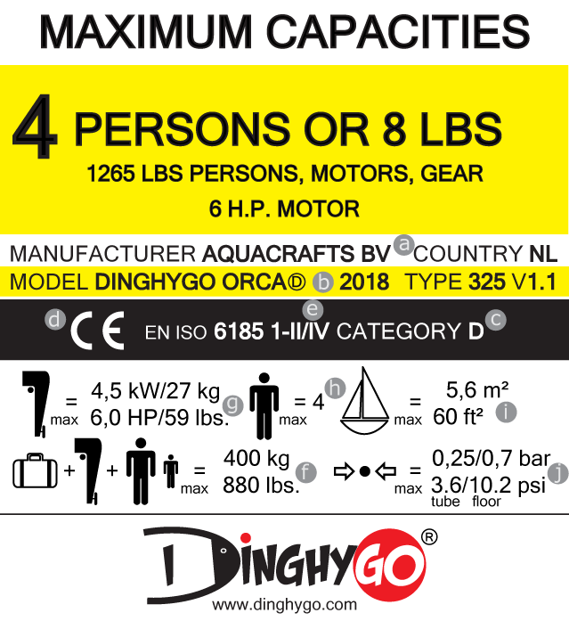
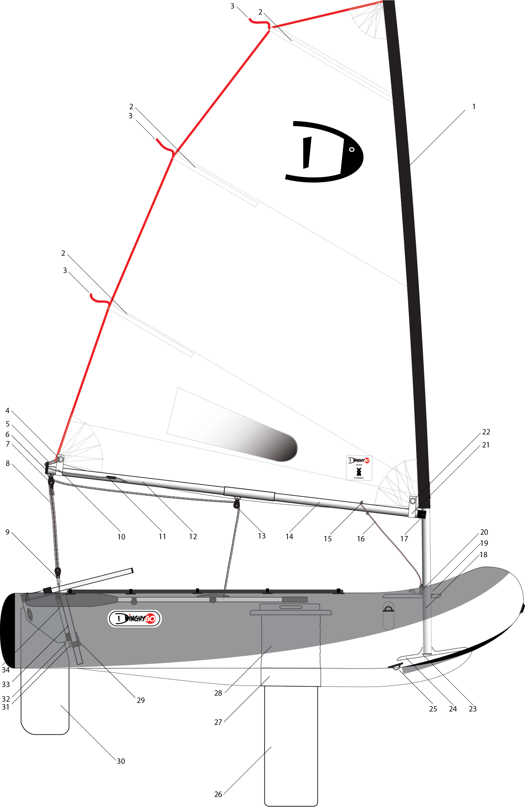
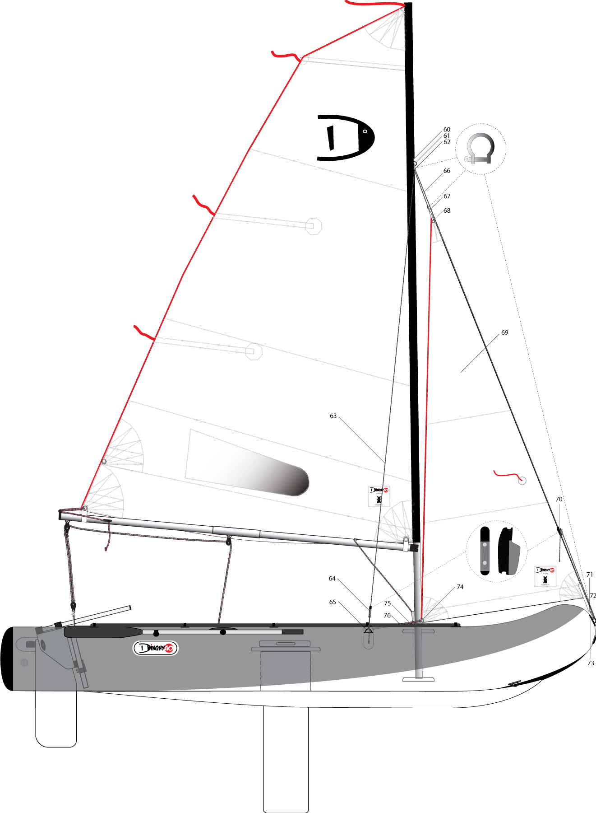
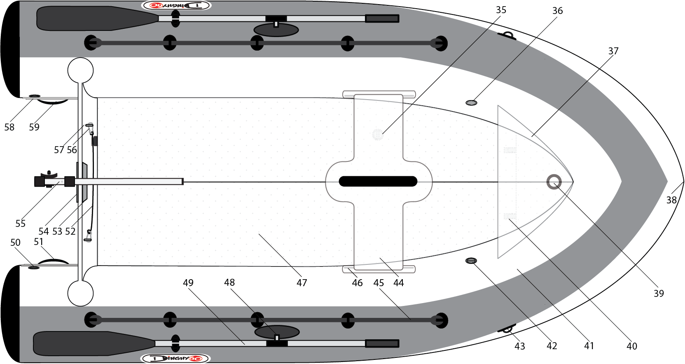
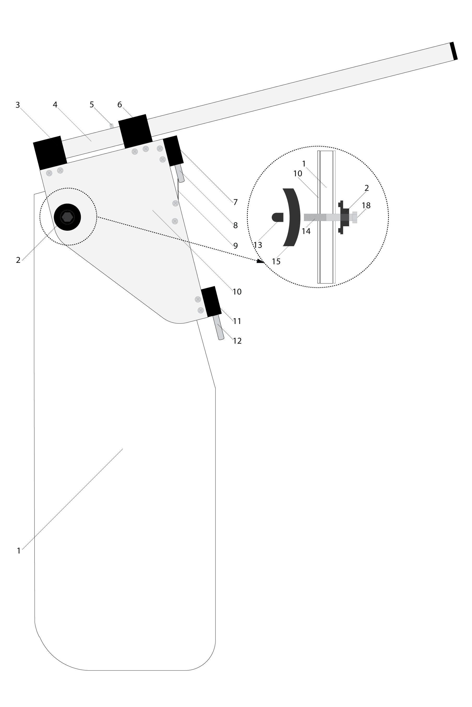
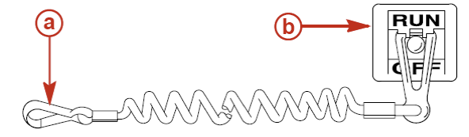

## 1. Información general

### 1.1 Introducción

Este manual de usuario ha sido redactado para garantizar la seguridad y el disfrute durante el uso de su DinghyGo, el velero inflable 3 en 1. Este manual contiene información detallada sobre la embarcación, su equipamiento, sus sistemas, así como información sobre su uso y mantenimiento. Le rogamos que lea atentamente este manual y que vea detenidamente los vídeos de instrucción DinghyGo; es importante que se familiarice con la embarcación antes de su uso.

Este manual de usuario no es un curso de seguridad marítima ni de navegación. Si es su primera experiencia con una embarcación, o si no conoce este tipo particular de embarcación, asegúrese de garantizar su propia seguridad y comodidad adquiriendo experiencia en la conducción y el uso de una embarcación (velero y barco de motor) antes de utilizar su DinghyGo.

Su distribuidor DinghyGo, la federación nacional de vela o su club náutico podrán asesorarle sobre las escuelas de vela y los clubes de vela locales con instructores cualificados. Asegúrese de que su DinghyGo es adecuado para las condiciones de viento y mar previstas, y de que usted y su tripulación son capaces de controlar la embarcación en dichas condiciones.

Este manual no proporciona una guía detallada para el mantenimiento o las reparaciones de la embarcación.

En caso de problemas, póngase en contacto con su distribuidor DinghyGo. Siga las instrucciones de mantenimiento y reparación proporcionadas en este manual para un mantenimiento correcto de su DinghyGo. Consulte siempre a especialistas formados y competentes para el mantenimiento, las reparaciones o las modificaciones. Las modificaciones realizadas en la embarcación que puedan afectar a la seguridad de la misma solo pueden ser evaluadas, ejecutadas y documentadas por personas competentes. Su distribuidor, Aquacrafts B.V., no puede ser considerado responsable de las modificaciones que no hayan sido aprobadas por él. En algunos países se requiere una licencia o un permiso para utilizar esta embarcación, y a veces se aplican normas específicas. Asegúrese siempre de que su embarcación esté bien mantenida y tenga en cuenta que el desgaste se producirá con el tiempo, especialmente debido a un uso intensivo o un uso inadecuado. Cada embarcación está diseñada para ser robusta, pero su embarcación puede sufrir daños graves en caso de uso incorrecto. Adapte siempre la velocidad y la dirección de la embarcación a su entorno. La tripulación debe estar familiarizada con todos los procedimientos de seguridad y emergencia (hombre al agua, remolque, etc.). Las escuelas de vela y los clubes organizan regularmente sesiones de formación para ayudarle si es necesario.

En algunos países, llevar un chaleco salvavidas o un dispositivo de ayuda a la flotabilidad que cumpla la normativa nacional es obligatorio en todo momento.

Este manual utiliza los siguientes símbolos de seguridad:

!!! warning "ADVERTENCIA"
    Indica una situación potencialmente peligrosa que, si no se evita, podría causar lesiones o la muerte.

!!! danger "PELIGRO"
    Indica una situación inmediatamente peligrosa que, si no se evita, causará lesiones graves o la muerte.

!!! caution "PRECAUCIÓN"
    Indica una situación potencialmente peligrosa que, si no se evita, podría causar lesiones leves o moderadas o daños materiales. También puede advertir sobre prácticas peligrosas.

!!! info ""
    Guarde este manual en un lugar seguro y entréguelo al nuevo propietario si decide revender su DinghyGo.

### 1.2 Categoría CE

Su DinghyGo está diseñado para su uso como embarcación de **Categoría D**:

Categoría D. Una embarcación diseñada para su uso con viento de hasta fuerza 4 en la escala Beaufort, y la correspondiente altura significativa de ola no superior a 0,3 metros, con olas ocasionales de una altura máxima de 0,5 m. Estas condiciones se encuentran en aguas costeras protegidas y aguas interiores, incluyendo pequeñas bahías, pequeños lagos, ríos y canales con buen tiempo.

☝︎ La altura de ola corresponde a la altura media del tercio superior de las olas, lo que corresponde aproximadamente a la altura de ola estimada por un observador experimentado. Sin embargo, algunas olas pueden ser el doble de altas.

!!! warning "ADVERTENCIA"
    Tome las precauciones necesarias si la embarcación se utiliza desde un barco nodriza en mar abierto. ¡Nunca pierda el contacto con el barco nodriza!

    **¡Lleve siempre un chaleco salvavidas!**

### 1.3 Norma ABYC

Su DinghyGo cumple con la norma American Boat & Yacht Council (ABYC) H-28 Tipo 1 Embarcaciones Inflables.

### 1.4 Placa de fabricante (placa de capacidad)

La placa de fabricante con la información del fabricante DinghyGo Aquacrafts B.V. se encuentra en el interior del espejo de popa de la embarcación.

*Representación de la placa de fabricante (Orca 325)*

Explicación de la placa de fabricante:

a. Nombre del fabricante
b. Modelo, tipo y versión de la embarcación
c. Categoría de la embarcación — véase Tabla 2.1
d. Marcado CE
e. ISO 6185 parte y tipo
f. Carga máxima (personas + motor fuera de borda + combustible + equipo)
g. Potencia máxima y peso del motor fuera de borda
h. Capacidad máxima / número de personas
i. Superficie máxima de vela
j. Presión máxima de las cámaras de aire y del suelo

### 1.5 Normativa nacional

Antes de su uso, compruebe la normativa local para ver si se aplican restricciones a las aguas en las que desea navegar. Preste especial atención a las restricciones relativas a la vela, la velocidad, el uso del kit de vela (sailkit) o del motor fuera de borda, las restricciones de ruido en el agua, etc.

### 1.6 Información general de seguridad

☝︎ Consejos para una navegación segura

Para disfrutar con seguridad de las vías navegables, debe familiarizarse con las normativas y restricciones locales y gubernamentales relativas a la navegación de recreo. Tenga en cuenta las siguientes recomendaciones:

* Utilice chalecos salvavidas o dispositivos de ayuda a la flotabilidad. Asegúrese de que haya un chaleco salvavidas o un dispositivo de ayuda a la flotabilidad adecuado disponible para cada persona a bordo y de que sea fácilmente accesible (obligatorio por ley en algunos países).
* No supere la carga máxima recomendada. En caso de duda, póngase en contacto con su distribuidor DinghyGo.
* Realice las comprobaciones de seguridad y el mantenimiento necesarios. Siga un calendario regular y asegúrese de que todas las reparaciones se realicen correctamente.
* Asegúrese de conocer todas las normas y leyes náuticas aplicables y de cumplirlas.

☝︎ Asegúrese de que todos los pasajeros de la embarcación estén correctamente sentados. No se siente en ninguna parte de la embarcación o del aparejo que no esté destinada a servir de asiento.

Esto incluye los bordes del espejo de popa, la proa y el puente, donde una aceleración repentina e inesperada podría hacer perder el equilibrio. Una parada repentina, una pérdida inesperada de control sobre la embarcación o el aparejo, y un movimiento brusco de la embarcación podrían lanzar a una persona por la borda o hacia el interior de la embarcación.

☝︎ Asegúrese de NUNCA estar bajo la influencia del alcohol o las drogas durante la navegación (obligatorio por ley). El alcohol y las drogas tienen un efecto negativo sobre su juicio y reducen considerablemente su capacidad de reacción en el agua.

Si es posible, prepare a otras personas a bordo en caso de que el operador quede incapacitado o caiga por la borda: instruya al menos a otra persona en los principios básicos de la vela, el arranque y el uso del motor fuera de borda, y la conducción de la embarcación.

☝︎ Detenga el motor fuera de borda cuando los pasajeros embarquen, desembarquen o se encuentren en la popa de la embarcación. Poner simplemente el motor fuera de borda en punto muerto no es suficientemente seguro.

Manténgase alerta. El operador de la embarcación es legalmente responsable de vigilar y escuchar correctamente. El operador debe tener una visión despejada, en particular hacia la proa. Los pasajeros y la carga no deben obstruir la visión del operador cuando la embarcación está en movimiento.

☝︎ Nunca dirija su embarcación directamente detrás de un esquiador acuático (o wakeboarder), ya que podría caer. Si el esquiador acuático se encuentra a 61 m (200 pies) delante de usted y su embarcación avanza a una velocidad de 20 km/h (12,5 mph), solo tardará diez segundos en alcanzarlo.

Esté atento a las caídas de los esquiadores acuáticos. El operador debe poder ver siempre al esquiador caído y nunca dar marcha atrás hacia el esquiador o hacia alguien en el agua. Notifique todos los accidentes.

## 2. Especificaciones, descripción y funciones

### 2.1 Especificaciones

Los modelos DinghyGo están sujetos a la Directiva de Embarcaciones de Recreo 2013/53/UE. Se adjunta un ejemplo de declaración de conformidad en el anexo de este manual.

| **Especificaciones técnicas DinghyGo** | | | |
| --- | --- | --- | --- |
| *Modelo* | Orca 280 | Orca 325 | Orca 375 |
| Especificaciones de la embarcación |  |  |  |
| Categoría CE | D | D | D |
| Número de cámaras de aire | 3 | 3 | 3 |
| *Dimensiones y peso \** |  |  |  |
| Eslora (ft/cm) | 9'2"/280 | 10'7"/325 | 12'3"/375 |
| Manga (ft/cm) | 4'9"/150 | 4'9"/150 | 4'9"/150 |
| Calado (ft/cm) | 2'8"/85 | 2'8"/85 | 2'8"/85 |
| Diámetro de los tubos (in/cm) | 16"/40 | 16"/40 | 16"/40 |
| Peso (lbs/kg) | 60/27 | 64/29 | 71/32 |
| *Capacidad (máxima)* |  |  |  |
| Personas (sin/con aparejo) | 3/2 | 4/2,5 | 5/3 |
| Carga útil (lbs/kg) | 660/300 | 880/400 | 1.100/500 |
| Motor fuera de borda (kW/cv) | 4,5/6,0 | 4,5/6,0 | 4,5/6,0 |
| Presión tubos/suelo (psi) | 3,6/10,2 | 3,6/10,2 | 3,6/10,2 |
| Dimensiones embaladas \*\* (LxAxA in) | 40"x21"x13" | 40"x28"x13" | 40"x28"x15" |
| Dimensiones embaladas \*\* (LxAxA cm) | 100x54x32 | 100x72x32 | 100x72x38 |
| Especificaciones del aparejo |  |  |  |
| *Dimensiones y peso \** |  |  |  |
| Longitud del mástil (ft/cm) | 14'1"/430 | 14'1"/430 | 14'1"/430 |
| Longitud de la botavara (ft/cm) | 7'4"/225 | 7'4"/225 | 7'4"/225 |
| Superficie de vela (sq.ft/m²) | 52/4,8 | 60/5,6 | 64/5,9 |
| Peso (lbs/kg) | 32/14 | 33/15 | 37/17 |
| Dimensiones embaladas \*\* (LxAxA in) | 47"x18"x7" | 47"x18"x7" | 47"x18"x8" |
| Dimensiones embaladas \*\* (LxAxA cm) | 120x45x17 | 120x45x18 | 120x45x20 |
| \*) Las especificaciones pueden diferir en un 5% | | | |
| \*\*) Peso y dimensiones embaladas sin cartón, materiales de embalaje ni bolsa. | | | |

*Tabla de especificaciones del modelo*

### 2.2 Modelo

DinghyGo es un velero inflable tres en uno que adquiere su forma, solidez y flotabilidad al ser llenado de aire. La embarcación está diseñada para salidas cortas en aguas protegidas y abiertas, tal como se indica en la sección "Categoría CE". Los diferentes modelos DinghyGo se especifican en la tabla de especificaciones del modelo.

### 2.3 Capacidad

!!! warning "ADVERTENCIA"
    No supere el número máximo de personas. Independientemente del número de personas a bordo, el peso total de las personas y el equipo nunca debe superar la carga máxima recomendada. Utilice siempre el banco/asiento.

### 2.4 Carga útil

!!! warning "ADVERTENCIA"
    Al cargar la embarcación, no supere nunca la carga máxima recomendada. Extreme siempre la precaución al cargar y distribuya las cargas adecuadamente para mantener una flotabilidad correcta. Evite colocar cargas pesadas en altura.

La carga máxima recomendada comprende exclusivamente:

a. El número de personas de 75 kg cada una. Si hay niños en la tripulación, el número máximo de personas puede aumentarse siempre que el peso de cada niño no supere los 37,5 kg y no se supere el peso total;
b. El equipo básico, incluido el kit de vela (sailkit) y el equipo de remo;
c. La carga (en su caso), los equipos secos, los líquidos consumibles [no incluidos en d.] y el equipo diverso que no forma parte del peso de la embarcación ni se menciona en b., incluido el motor fuera de borda;
d. Los líquidos útiles (agua dulce, combustible) llenados a su capacidad máxima en depósitos portátiles.

### 2.5 Kit de vela (sailkit)

La superficie máxima de vela del aparejo (kit de vela / sailkit) se indica en la "tabla de especificaciones del modelo" y en la placa de capacidad.

La instalación y el uso del kit de vela (sailkit) se describen en los capítulos "Montaje y desmontaje", "Recomendaciones de seguridad y uso" y en el anexo "Montaje del timón / botavara Orca…" de este manual.

!!! warning "ADVERTENCIA"
    El uso de un kit de vela (sailkit) demasiado grande o no original puede dañar gravemente la embarcación o causar lesiones corporales, especialmente con viento excesivo. Utilice siempre el kit de vela DinghyGo original correspondiente, cuya superficie sea inferior o igual a la superficie máxima de vela especificada. Nunca navegue con viento superior a la velocidad máxima especificada en la sección "Categoría CE".

### 2.6 Motor fuera de borda

La potencia máxima de esta embarcación se indica en la "tabla de especificaciones del modelo" y en la placa de capacidad.

La instalación del motor fuera de borda y las instrucciones adicionales de conducción se describen en el capítulo "Montaje y desmontaje" de este manual.

!!! danger "PELIGRO"
    El uso de un motor fuera de borda a potencia máxima puede causar lesiones graves, la muerte o daños en la embarcación.

!!! danger "PELIGRO"
    Podría perder el control de la embarcación al utilizar el motor fuera de borda a toda velocidad. Pueden producirse accidentes. El distribuidor (Aquacrafts B.V.) no puede ser considerado responsable de estas acciones.

!!! warning "ADVERTENCIA"
    Tenga precaución al repostar combustible: no fume y limpie cualquier derrame de combustible. Tenga cuidado al instalar el motor fuera de borda para evitar dañar el tubo de combustible. Asegúrese de que ningún material combustible pueda entrar en contacto con las piezas del motor.

### 2.7 Representaciones visuales

#### 2.7.1 Orca 280 — Vista lateral

*Orca 280 — Vista lateral*

**Descripción**

| **No.** | **Denominación** | **No.** | **Denominación** |
|---|---|---|---|
| 1 | Funda del mástil | 18 | Traba del mástil |
| 2 | Sables de la vela | 19 | Cubierta |
| 3 | Cintas indicadoras | 20 | Mordaza del mástil |
| 4 | Puño de escota | 21 | Velcro |
| 5 | Tensor de alunamiento | 22 | Puño de amura |
| 6 | Extremo de botavara | 23 | Pie del mástil |
| 7 | Pasteca de escota con grillete | 24 | Carlinga del mástil |
| 8 | Escota mayor | 25 | Argolla en D / Argolla de remolque |
| 9 | Pasteca de escota con grillete de liberación rápida | 26 | Orza central |
| 10 | Velcro | 27 | Caja de la orza |
| 11 | Mordaza de botavara | 28 | Caja de la orza flexible |
| 12 | Sección trasera de botavara | 29 | Autovaciador |
| 13 | Pasteca de escota de vela | 30 | Timón |
| 14 | Sección delantera de botavara | 31 | Macho del timón |
| 15 | Tope del bajante | 32 | Hembra del timón |
| 16 | Bajante | 33 | Espejo de popa |
| 17 | Cuello de cisne | 34 | Clip de retención |

#### 2.7.2 Orca 375 — Vista lateral

*Orca 375 — Vista lateral*

**Descripción** — Elementos adicionales (obenques y soporte de mástil)

| **No.** | **Denominación** | **No.** | **Denominación** |
|---|---|---|---|
| 60 | Apertura de la funda del mástil | 63 | Obenque |
| 61 | Ojete del mástil | 64 | Mordaza de obenque (flotante) |
| 62 | Grillete de obenque | 65 | Argolla en D obenque/davit |

**Descripción** — Elementos adicionales (foque)

| **No.** | **Denominación** | **No.** | **Denominación** |
|---|---|---|---|
| 66 | Driza | 72 | Grillete de foque (puño de escota) |
| 67 | Grillete de driza | 73 | Argolla en D de proa |
| 68 | Cabeza de foque | 74 | Puño de escota del foque |
| 69 | Foque | 75 | Escota del foque |
| 70 | Mordaza de driza | 76 | Argolla en D de escota del foque |
| 71 | Puño de amura del foque |  |  |

#### 2.7.3 Orca 280 — Vista superior

*Orca 280 — Vista superior*

**Descripción**

| **No.** | **Denominación** | **No.** | **Denominación** |
|---|---|---|---|
| 35 | Válvula del suelo (n° 4) | 48 | Tolete |
| 36 | Válvula (n° 1) | 49 | Remo |
| 37 | Cubierta | 50 | Válvula (n° 3) |
| 38 | Asa de proa | 51 | Asa trasera |
| 39 | Collarín del mástil | 52 | Estribo de escota |
| 40 | Tope de carlinga del mástil | 53 | Placa de motor delantera |
| 41 | Válvula de sobrepresión | 54 | Placa de motor trasera |
| 42 | Ojete de izado | 55 | Caña del timón |
| 43 | Válvula de sobrepresión del suelo | 56 | Mosquetón |
| 44 | Banco/caja de la orza | 57 | Ojete de izado y de estribo |
| 45 | Cabo | 58 | Válvula (n° 2) |
| 46 | Correa de fijación del banco | 59 | Asa trasera |
| 47 | Suelo 3D |  |  |

#### 2.7.4 Timón abatible — Vista lateral/trasera

*Timón abatible — Vista lateral (izquierda) y vista trasera (derecha)*

**Descripción**

| **No.** | **Denominación** | **No.** | **Denominación** |
|---|---|---|---|
| 1 | Pala del timón | 11 | Soporte del macho del timón (inferior) |
| 2 | Soporte del perno | 12 | Macho del timón |
| 3 | Soporte de caña del timón (trasero) | 13 | Protector del perno |
| 4 | Caña del timón | 14 | Perno |
| 5 | Muelle de la caña del timón | 15 | Tuerca mariposa |
| 6 | Soporte de caña del timón (delantero) | 18 | Cabeza del perno |
| 7 | Soporte del macho del timón (superior) | 20 | Cabeza del perno |
| 8 | Macho del timón |  |  |
| 9 | Clip de seguridad |  |  |
| 10 | Cabeza del timón |  |  |

## 3. Montaje y desmontaje

☝︎ Vea detenidamente los vídeos de instrucción DinghyGo sobre el montaje y desmontaje de la embarcación. Recibirá estos vídeos de instrucción con su DinghyGo. También puede pedirlos a su distribuidor DinghyGo.

### 3.1 Suelo inflable

Las embarcaciones DinghyGo están equipadas con un suelo inflable que debe estar correctamente inflado. El uso de la embarcación sin un suelo correctamente inflado es peligroso, incómodo y puede dañar la embarcación. Consulte la sección "Inflado del suelo inflable" para saber cómo inflar el suelo inflable.

### 3.2 Válvulas de inflado

Las válvulas de inflado de la embarcación están especialmente diseñadas para un uso seguro y cómodo. Las válvulas planas están diseñadas para mejorar la comodidad a bordo y evitar daños en la embarcación.

  
  
Imagen de una válvula de inflado

#### 3.2.1 Uso de las válvulas

* Retire la tapa exterior. La válvula está cerrada cuando el botón central con rosca está en posición alta.
* Para abrir la válvula, coloque su dedo en el centro de la válvula y presione el botón central con rosca hacia abajo. Gire su dedo un cuarto de vuelta en el sentido de las agujas del reloj hasta que el botón quede bloqueado.
* Para cerrar la válvula, presione el botón y gire su dedo un cuarto de vuelta en el sentido de las agujas del reloj hasta que el botón suba.

#### 3.2.2 Conexiones de la bomba

* Fije la boquilla de la bomba (la parte en punta) a la válvula.
* Gírela hacia la derecha (en el sentido de las agujas del reloj) hasta que quede bloqueada y comience a bombear.
* Continúe bombeando hasta que la embarcación esté completamente inflada.
* Desconecte la bomba una vez terminado.
* Asegúrese de que la tapa esté colocada de nuevo (para protegerla de la suciedad y los daños).

#### 3.2.3 Comprobación de fugas de aire

En caso de fuga de aire:

* Saque la llave de válvula del kit de reparación.
* Inserte la llave en la válvula y gírela en el sentido de las agujas del reloj. Compruebe si el problema está resuelto.
* Si descubre una fuga, póngase en contacto con su distribuidor DinghyGo y compruebe la garantía.
* Tome la parte trasera de la válvula con las manos y gire el vástago hacia la izquierda con la llave (sentido antihorario) y retire el vástago.
* Inspeccione la válvula para detectar cualquier daño.
* En caso de daño (véase el anexo "Garantía"), lleve la válvula defectuosa a su distribuidor DinghyGo. Recibirá una nueva válvula dentro del período de garantía.
* Lubrique el vástago con silicona o agua jabonosa y vuelva a instalarlo.

### 3.3 Equipo de remo

Se suministran dos remos con la embarcación. Las palas pueden separarse de los mangos para facilitar el transporte. Los remos deben colocarse correctamente en los toletes. Sujete el remo paralelo al tubo con la pala orientada hacia la proa e inserte el pasador tan profundamente como sea posible en el tolete. A continuación, gire el remo hacia el exterior 180 grados para fijarlo en el tolete.

### 3.4 Kit de vela (sailkit)

Su DinghyGo se suministra con un kit de vela (sailkit), que incluye:

* Banco (el Orca 375 incluye 2 mordazas de escota del foque) / caja de la orza
* Carlinga del mástil
* Orza central
* Timón
* Mástil seccional
* Botavara seccional
* Vela mayor
* Juego de cabos (escotas, obenques con mordazas, grillete, elástico de la orza central)
* Bolsa del kit de vela

La instalación y el aparejado del equipo de vela se explican más adelante en el manual, incluidos sus anexos.

### 3.5 Banco / asiento

El DinghyGo está equipado con un banco especial y una "correa de fijación del banco" en los dos tubos laterales, sobre la cual se desliza el banco. El banco también sirve como ranura superior para la caja de la orza.

☝︎ Debe instalar el banco antes de inflar completamente la embarcación.

### 3.6 Inflado de los tubos

Desenrolle la embarcación sobre el suelo para inflarla. Retire cualquier objeto punzante de la superficie sobre la que se infla la embarcación.

* Tras sacar la embarcación de su embalaje, compruebe que todos los componentes están presentes.
* Compruebe que las válvulas están cerradas. Para ello, coloque un dedo en la válvula, presione el pequeño botón gris con rosca y gírelo ligeramente hacia la derecha.
* Si el botón sube ligeramente, puede proceder al inflado de la embarcación. (¡Para desinflar la embarcación, gire el botón hacia la izquierda!)
* Utilice la bomba suministrada con la embarcación. Presione la boquilla (la punta) contra la válvula y gire hacia la derecha. La bomba se bloquea en la válvula.
* Bombee suficiente aire en la embarcación para darle la forma correcta.

☝︎ Todas las cámaras inflables deben inflarse por igual para evitar dañar los tabiques.

☝︎ Inflar y desinflar correctamente su embarcación es fundamental para su durabilidad.

#### 3.6.1 Orden de inflado

Inflate la embarcación en el orden ascendente de los números que figuran en las etiquetas de las válvulas:

1. Cámara delantera (n° 1)

2. Cámaras laterales (n° 2 y 3)

3. Suelo (n° 4)

#### 3.6.2 Inflado de los tubos

Paso 1: Bombee aire en la cámara delantera a través de la válvula de inflado hasta alcanzar la presión especificada.

Paso 2: Bombee aire en las dos cámaras laterales en el orden correcto hasta alcanzar la presión especificada.

Si el inflado se realiza en el orden correcto, la embarcación tendrá la presión correcta y no habrá deformación de los tubos.

Paso 3: Cierre todas las válvulas insertando las tapas de válvula y girándolas en el sentido de las agujas del reloj.

☝︎ ¡Nunca supere los valores indicados en la placa de fabricante y las etiquetas de válvula! Infle los tubos a 0,25 bar = 3,6 psi = 25 kPa y el suelo a 0,19 bar = 2,75 psi = 19 kPa (tolerancia ±20%). Infle el suelo Orca a 0,7 bar = 10,2 psi = 70 kPa.

☝︎ No utilice compresores mecánicos para inflar su embarcación. La bomba manual suministrada está ajustada para crear la presión perfecta para su embarcación. Si lo prefiere, puede utilizar una bomba eléctrica disponible como opción en su distribuidor DinghyGo. Utilice los ajustes de presión correctos para facilitar el inflado correctamente.

!!! caution "PRECAUCIÓN"
    Un inflado incorrecto puede causar daños estructurales en su embarcación. Retire su embarcación de la exposición directa al sol cuando esté fuera del agua. El sol directo provoca la dilatación del aire en la embarcación, lo que puede dañarla (excepto con el uso y el mantenimiento correctos de la válvula de sobrepresión).

### 3.7 Inflado del suelo inflable

Cuando infle completamente el suelo inflable, este se encaja entre los tubos laterales y el espejo de popa.

Paso 1: Bombee aire en el suelo a través de la válvula, igual que para los tubos laterales, hasta alcanzar la presión especificada.

Paso 2: Cierre la válvula insertando la tapa de válvula y girándola en el sentido de las agujas del reloj.

### 3.8 Montaje y desmontaje del aparejo

La bolsa del kit de vela contiene el equipo de vela completo. Disponga todos los componentes de vela para facilitar la instalación y el aparejado.

#### 3.8.1 Instalación de la carlinga del mástil, el banco y el estribo de escota

* Infle parcialmente la proa y los tubos laterales (véase la sección "Inflado de los tubos"), de modo que tengan cierta forma pero no estén completamente a presión. No infle todavía el suelo.
* Deslice la carlinga del mástil por debajo de los tubos hasta que se posicione delante de los topes de carlinga del mástil en el suelo (en la proa de la embarcación).
* Deslice el banco / caja de la orza sobre las correas de fijación del banco en los tubos, hasta que quede posicionado directamente encima de la apertura de la caja de la orza en el suelo.
* Fije un extremo del estribo de escota al ojete del espejo de popa y fije el otro extremo al otro ojete del espejo de popa con el mosquetón.

#### 3.8.2 Inflado de la embarcación

* Infle completamente los tubos y el suelo (véanse las secciones "Inflado de los tubos" e "Inflado del suelo inflable"), de modo que la carlinga del mástil y el banco / caja de la orza queden firmemente encajados.
* Fije a continuación la parte flexible de la caja de la orza con el velcro en la parte inferior del banco / caja de la orza.
* Instale los remos (véase la sección "Instalación de los remos").

#### 3.8.3 Aparejado

* Asegúrese de que el timón y la botavara Orca estén correctamente montados tras el desembalaje según el anexo.
* Monte las secciones de mástil y botavara.
* Tome la vela mayor e inserte los sables de la vela.
* Deslice el mástil por la funda del mástil de la vela mayor.
* Fije los obenques a través de la apertura de la funda del mástil con el grillete de obenque al ojete de la sección superior del mástil.
* Pase la driza del foque a través del ojete del foque en el ojete de la sección superior del mástil, fije el mosquetón al lazo de driza por encima del grillete de obenque (solo Orca 375).
* Coloque el mástil en el pie del mástil, a través del collarín del mástil.
* Fije los obenques a ambos lados de los tubos pasando el obenque por la argolla en D del tubo y fijándolo en la mordaza de obenque. Asegúrese de que el mástil esté vertical con solo una ligera tensión de obenque.
* Fije el puño de amura del foque con el grillete a la argolla de proa y fije el mosquetón a la cabeza del foque. Ice el foque, pase la driza por la argolla de proa, insértela en la mordaza y apriete firmemente (solo Orca 375).
* Fije la botavara al mástil encajando el extremo delantero de la botavara en el mástil.
* Fije las dos bandas de velcro de la vela mayor a la botavara.
* Aplique el bajante y el tensor de alunamiento con la tensión correcta.
* Fije la pasteca de escota con grillete de liberación rápida al estribo de escota.
* Fije la escota del foque al puño de escota del foque, pase la escota por las argollas del foque en los tubos y haga un nudo en ocho. La escota puede fijarse en diagonal en las mordazas del banco durante la navegación (Orca 375).

!!! warning "ADVERTENCIA"
    Asegúrese de que el aparejo esté correctamente insertado recto a través del collarín del mástil en el pie del mástil hasta el suelo.

!!! warning "ADVERTENCIA"
    Asegúrese de que el mástil esté vertical y correctamente mantenido y soportado por los obenques fijados al mástil y a ambos lados de los tubos. La fijación incorrecta de los obenques puede provocar el aflojamiento del aparejo, lo que puede hacer que se pierda el control de la embarcación y causar lesiones a la tripulación.

#### 3.8.4 Preparación antes de la puesta en el agua

* Fije el timón al espejo de popa. Asegúrese de que el timón esté bloqueado con el clip de retención.
* Deslice la orza central a través del banco en la caja de la orza.
* Cierre el autovaciador.

☝︎ La orza central debe insertarse en la caja de la orza con el perfil redondeado orientado hacia la proa. Una orza central mojada facilita la inserción en la caja. El elástico suministrado, cuyos extremos están anudados para formar un lazo, puede pasarse alrededor de la orza central y el banco para mantener la orza en la posición requerida.

☝︎ El estribo de escota debe fijarse por encima de la caña del timón.

!!! warning "ADVERTENCIA"
    Fije el timón con el clip de retención. Una fijación incorrecta puede provocar la pérdida del timón y la pérdida de dirección de la embarcación, lo que puede dar lugar a situaciones peligrosas.

!!! warning "ADVERTENCIA"
    Fije siempre la caña del timón en la cabeza del timón antes de navegar. De lo contrario, el timón podría dañarse y provocar la pérdida de dirección de la embarcación, lo que podría causar situaciones peligrosas.

#### 3.8.5 Navegación a vela

Este manual no proporciona instrucciones de navegación a vela y asume que el operador y los pasajeros tienen suficiente experiencia y cualificaciones de navegación. Su distribuidor DinghyGo o su club náutico puede informarle sobre las posibilidades de formación, como los cursos de vela.

!!! warning "ADVERTENCIA"
    Navegue solo después de asegurarse de que usted y su tripulación tienen suficiente experiencia de navegación y saben cómo reaccionar ante las condiciones (esperadas), los riesgos de seguridad, el rendimiento individual y el funcionamiento de la embarcación. Asegúrese de que el equipo de la tripulación y la embarcación estén en buen estado. Un uso incorrecto, un equipo defectuoso y condiciones inadecuadas pueden dar lugar a situaciones peligrosas.

#### 3.8.6 Desmontaje del aparejo

* Retire el timón del espejo de popa presionando/soltando el clip de retención.
* Retire la orza central de la caja de la orza y del banco.
* Arríe el foque tirando de la driza de la mordaza, baje el foque y desenganche la cabeza del foque del mosquetón de driza. Desenganche el mosquetón del lazo de driza, tire de la driza del ojete del foque en el mástil y de la argolla en D de la proa (Orca 375).
* Desconecte la pasteca de escota del estribo abriendo el grillete de liberación rápida.
* Desenganche los obenques de ambos lados de las argollas en D de los tubos soltándolos de las mordazas de obenque.
* Levante el aparejo fuera del pie del mástil en línea recta a través del collarín del mástil.
* Suelte el tensor de alunamiento y el bajante y desenganche la botavara del mástil.
* Separe las secciones de botavara.
* Retire los sables de la vela, desenganche los obenques del mástil soltando el grillete de obenque y deslice la funda del mástil fuera del mástil.
* Separe las secciones de mástil.

#### 3.8.7 Retirada de la carlinga del mástil y el banco

* Desinfle parcialmente el suelo y los tubos (véase la sección "Desinflado de la embarcación"), de modo que todavía tengan forma pero ya no estén a presión.
* Desenganche la parte flexible de la caja de la orza de la parte inferior del banco.
* Deslice el banco hacia atrás fuera de sus correas de fijación en los tubos.
* Tire de la carlinga del mástil fuera de los topes desde la proa de la embarcación. Levantar la proa con una mano facilita la extracción.
* Retire los remos de los toletes después de girarlos 180 grados con la pala hacia la proa paralela al tubo y separe los remos.

#### 3.8.8 Almacenamiento del kit de vela

* Asegúrese de que todos los elementos del kit de vela estén limpios y secos. Las piezas que hayan estado expuestas al agua de mar (salada) deben lavarse y limpiarse inmediatamente con agua dulce después del uso.
* Coloque la bolsa del kit de vela sobre el suelo con la abertura hacia usted.
* Comience por meter la orza central y el timón en la bolsa del kit de vela y luego apile las secciones de mástil y botavara encima.
* Añada los componentes de los remos a la bolsa.
* Añada el banco y la carlinga del mástil a la bolsa.
* Añada la vela mayor plegada, los sables de la vela y el juego de cabos a la bolsa.
* Añada el foque plegado y el juego de cabos del foque a la bolsa.
* Añada por último la bomba manual.
* Cierre firmemente la bolsa con las correas y las hebillas.
* Transporte la bolsa por las asas.
* Transporte y almacene la bolsa en un lugar protegido y seco, a temperatura normal, alejada de cargas pesadas, plagas, sustancias peligrosas y radiaciones.

☝︎ Durante el almacenamiento, el tensor de alunamiento, el bajante y la escota mayor con sus pastecas permanecen fijados a la botavara. El estribo de escota permanece fijado a los ojetes del espejo de popa en la embarcación.

### 3.9 Instalación de los remos

Las embarcaciones DinghyGo están equipadas con remos desmontables, toletes y un banco combinado con caja de la orza.

* Asegúrese de que el banco esté correctamente instalado (véase la sección "Instalación de la carlinga del mástil, el banco y el estribo de escota").
* Para instalar los remos en los toletes, sujete los remos paralelos a los tubos con la pala orientada hacia la proa (no hacia la popa, no entrarían) e inserte el pasador de fijación metálico tan profundamente como sea posible en el tolete.
* A continuación, gire los remos con las palas hacia el exterior, de modo que queden bien fijados en los toletes y puedan utilizarse correctamente.
* Cuando los remos no se utilicen, pueden guardarse a lo largo de los tubos, sujetos por los toletes y los portarremos elásticos en la parte trasera de los tubos laterales.

☝︎ Tenga en cuenta las condiciones locales antes de llevar su DinghyGo al agua, ya sea con el kit de vela (sailkit), los remos o un motor fuera de borda. Es posible que la potencia propulsora de la embarcación no sea suficiente para navegar contra una fuerte corriente de marea o de río.

!!! caution "PRECAUCIÓN"
    Una fijación incorrecta de los remos puede dañar los pasadores de fijación y los toletes. Si es necesario, retire el plástico sobrante de la parte inferior de la abertura del tolete.

### 3.10 Instalación de un motor fuera de borda

☝︎ Consulte la "tabla de especificaciones del modelo" de esta guía para conocer la potencia y el peso máximos del motor fuera de borda.

☝︎ El uso de un motor fuera de borda que supere la potencia o el peso máximo puede tener las siguientes consecuencias:

* Dificultades de maniobrabilidad y/o estabilidad de la embarcación
* Modificación de las características de flotabilidad o de navegación previstas de la embarcación
* Daños en la embarcación, especialmente en las zonas alrededor del espejo de popa

☝︎ Utilice un interruptor de apagado de emergencia. Este detendrá el motor fuera de borda si, por cualquier razón, el operador de la embarcación ha abandonado los controles.

!!! danger "PELIGRO"
    El uso de un motor fuera de borda con una potencia o un peso excesivos puede causar lesiones graves, la muerte o daños en la embarcación.

#### 3.10.1 Montaje del motor fuera de borda

* Asegúrese de estar en una posición segura y estable.
* Desbloquee el motor fuera de borda de modo que sea posible inclinar el soporte y luego monte el motor fuera de borda en el espejo de popa utilizando los tornillos del soporte.
* El motor fuera de borda debe instalarse en el centro del espejo de popa para un uso correcto. Al colocar el motor fuera de borda en el espejo de popa, tenga cuidado de no dañar las hembras del timón.
* El soporte de fijación debe atornillarse firmemente en las placas de motor del espejo de popa. Compruébelo periódicamente ya que en algunos motores los tornillos del soporte pueden aflojarse por vibración durante el uso.

!!! caution "PRECAUCIÓN"
    Puede haber motores fuera de borda que dañen las hembras del timón al fijarse al espejo de popa. Asegúrese de que su motor fuera de borda sea adecuado y, si es necesario, hágalo ajustar por un experto. También puede pedir ayuda a su distribuidor DinghyGo.

#### 3.10.2 Posición del motor fuera de borda

El motor fuera de borda debe instalarse de modo que esté vertical en el agua en posición de funcionamiento normal. Esto significa que la "placa anticavitación" en la parte inferior del motor fuera de borda está colocada horizontalmente en el agua cuando la embarcación está en posición normal. En la mayoría de los motores fuera de borda existe una forma de ajustar el ángulo del eje con respecto al soporte; consulte a su distribuidor de motores fuera de borda si no está seguro de cómo hacerlo.

#### 3.10.3 Arranque del motor fuera de borda

* Empuje la embarcación al agua.
* Fije el motor fuera de borda en la posición correcta con los tornillos del soporte.
* Asegúrese de estar bien estable y arranque a continuación el motor fuera de borda.
* Evite las velocidades elevadas al dar marcha atrás con la embarcación. Es posible que el agua entre en la embarcación por encima del espejo de popa.

☝︎ Asegúrese de que el autovaciador en el espejo de popa esté cerrado antes de poner la embarcación en el agua.

### 3.11 Desinflado de la embarcación

☝︎ Asegúrese de que la embarcación esté limpia y seca antes de enrollarla para guardarla. Retire toda la arena y los residuos que puedan adherirse al material de revestimiento.

☝︎ No deje que la embarcación se desinfle cámara por cámara. Desinfle las cámaras por igual; esto evitará daños en los tabiques de la embarcación.

Desinflado:

* Coloque la embarcación sobre el suelo.
* Coloque su dedo en la válvula y gire el botón gris con rosca hacia la derecha (para más información sobre las válvulas, véase "Las válvulas").
* Deje salir un poco de aire de los tubos y el suelo.
* Asegúrese de que el interior de las válvulas esté abierto (para permitir que el aire salga durante el plegado).
* Presione uniformemente sobre toda la embarcación para expulsar la mayor cantidad de aire posible.

### 3.12 Plegado y almacenamiento de la embarcación

* Coloque la embarcación sobre el suelo.
* Retire todas las piezas de vela y remo, incluido el banco, la carlinga del mástil y los remos.
* Doble los tubos laterales hacia el centro, de modo que toda la embarcación tenga el mismo ancho que el espejo de popa.
* Doble la proa sobre la cubierta.
* Lleve la proa y la cubierta hacia atrás hasta el extremo de la caja de la orza.
* Doble los extremos traseros redondeados de los tubos hacia el centro del espejo de popa.
* Levante y tire del espejo de popa hacia delante sobre la parte ya plegada.
* Coloque el paquete plegado compacto sobre la bolsa de transporte extendida.
* Doble los dos trozos pequeños y luego los dos grandes de la bolsa alrededor del paquete y fíjelos con las correas y las hebillas.

### 3.13 Transporte

#### 3.13.1 Extracción de la embarcación del agua

Asegúrese de que no haya bordes cortantes en el lugar donde desee levantar la embarcación del agua.

Utilice preferiblemente los ojetes de izado o las asas para levantar, y no los cabos.

#### 3.13.2 Remolque de la embarcación

☝︎ Si la embarcación inflable debe ser remolcada por otra embarcación, debe estar vacía:

* Retire el aparejo, el motor fuera de borda, el depósito de combustible, las baterías y otros equipos.
* Cierre la caja de la orza en el suelo con el inserto flexible suministrado (en material EVA negro), enrolle la parte flexible de la caja de la orza y fíjela antes de cerrar.

☝︎ Importante: El asa de la proa no debe utilizarse para el remolque, el fondeo o el amarre.

* Utilice los anillos metálicos situados en los lados de babor y estribor de la proa para el remolque. Esto permite que la embarcación permanezca estable detrás de la embarcación remolcadora y evita daños en su embarcación.
* Fije un cabo entre los anillos de remolque para formar una cruz. Fije un cabo de remolque a este y remolque la embarcación a baja velocidad.

!!! warning "ADVERTENCIA"
    * Nunca remolque la embarcación con personas a bordo.
    * Compruebe regularmente el cabo de remolque.
    * Compruebe periódicamente las condiciones de remolque y asegúrese de que no entre agua en la embarcación.

## 4. Recomendaciones de seguridad y uso

### 4.1 Instrucciones importantes de seguridad

☝︎ Interruptor de apagado de emergencia y cordón

El propósito del cordón del interruptor de apagado de emergencia es detener el motor fuera de borda cuando el operador de la embarcación se aleja suficientemente de su posición de operación, lo que activa el interruptor. Esto ocurre cuando el operador cae accidentalmente por la borda o se aleja demasiado de su puesto de control en la embarcación. Caer por la borda o ser proyectado accidentalmente del asiento son escenarios que pueden producirse después de un uso incorrecto, por ejemplo, sentarse en la borda a velocidades de planeo, levantarse a velocidades de planeo, operar a velocidades de planeo en aguas poco profundas o en aguas con muchos obstáculos, soltar la caña del timón que tiraba de un lado, el uso de alcohol o drogas, o realizar maniobras a velocidades peligrosamente altas.

*Diagrama del interruptor de apagado de emergencia*

Los motores fuera de borda con caña y algunas telecomandas están equipados con un interruptor de apagado de emergencia.

El cordón del interruptor de apagado de emergencia mide generalmente entre 122 y 152 cm (4'-5') de largo cuando está extendido. La primera parte debe colocarse en un extremo del interruptor (véase "Diagrama del interruptor de apagado de emergencia", elemento b.) y un sistema de enganche rápido (elemento a.) debe fijarse al operador en el otro extremo. El cordón es un cordón helicoidal para que sea lo más corto posible cuando no está extendido, y para que el riesgo de enredarse con objetos cercanos sea el menor posible.

La longitud del cordón extendido está coordinada para reducir al mínimo el riesgo de activación accidental; en caso de que el operador quiera desplazarse por la embarcación. Si se desea un cordón más corto en una determinada situación, el cordón puede enrollarse alrededor de la muñeca o la pierna del operador, o el operador puede hacer un nudo en el cordón. Aunque el motor fuera de borda se detiene inmediatamente al activarse el interruptor de apagado de emergencia, la embarcación continuará navegando o avanzando por inercia según la velocidad y la brusquedad del giro en el momento de la parada del motor fuera de borda. Sin embargo, la embarcación no dará un círculo completo.

Recomendamos encarecidamente que los demás pasajeros sean instruidos en los procedimientos correctos de arranque y funcionamiento, en caso de que tengan que operar el motor fuera de borda en una emergencia.

!!! warning "ADVERTENCIA"
    Si el operador cae de la embarcación, tenga en cuenta que la parada inmediata del motor fuera de borda puede reducir la probabilidad de muerte o lesiones graves por aplastamiento. Fije firmemente los dos extremos del cordón del interruptor de apagado de emergencia al interruptor por un lado y al operador por el otro lado.

☝︎ También puede producirse una activación accidental o involuntaria del interruptor durante el uso normal. Esto puede causar una o más de las siguientes situaciones potencialmente peligrosas:

* Los pasajeros podrían ser proyectados hacia adelante debido a una parada inesperada (o una pérdida de movimiento hacia adelante); esto es especialmente problemático para los pasajeros en la proa que podrían ser proyectados hacia adelante y sufrir lesiones por la caja de engranajes, el casco o la hélice.
* La pérdida de potencia y la pérdida de control direccional pueden producirse durante fuertes oleajes, fuertes corrientes o vientos violentos.
* Pérdida de control direccional durante el atraque.

!!! warning "ADVERTENCIA"
    Evite lesiones graves o la muerte debidas a las fuerzas de deceleración violentas resultantes de una activación accidental o involuntaria del interruptor de apagado de emergencia. El operador de la embarcación nunca debe abandonar su puesto de control sin haber desconectado primero el cordón del interruptor de apagado de emergencia de su cuerpo.

### 4.2 Lista de comprobación esencial antes del uso

* Compruebe la presión en las cámaras de aire.
* Retire cualquier obstáculo del autovaciador en el espejo de popa.
* Cierre el autovaciador del espejo de popa.
* Asegúrese de que la carlinga del mástil, el banco / caja de la orza y el estribo de escota estén correctamente instalados.
* Asegúrese de que la embarcación esté correctamente aparejada y de que el mástil esté posicionado en el pie del mástil y fijado bajo la cubierta con el sistema de bloqueo de resorte.
* Asegúrese de que la orza central esté instalada en la caja de la orza con el lado redondeado orientado hacia la proa.
* Asegúrese de que el timón esté bloqueado en el espejo de popa y de que la caña del timón esté fijada en la cabeza del timón.
* Asegúrese de que el estribo de escota esté fijado a los ojetes del espejo de popa, que pase por encima de la caña del timón y que esté unido a la pasteca de escota con el grillete de liberación rápida.
* Asegúrese de que los obenques estén firmemente fijados con el grillete de obenque al ojete de la sección superior del mástil y a las argollas en D de ambos lados del tubo con las mordazas de obenque.
* Asegúrese de que el grillete del puño de amura del foque esté fijado a la argolla en D de la proa y de que la driza esté firmemente fijada con el mosquetón a la cabeza del foque por un lado y a través del ojete del foque en la mordaza por el otro lado (solo Orca 375).
* Asegúrese de que el motor fuera de borda esté firmemente montado en el espejo de popa y de que la caja de la orza esté cerrada con el inserto suministrado si desea navegar a alta velocidad con un motor fuera de borda o remolcar la embarcación.
* Asegúrese de conocer el contenido del depósito de combustible y la velocidad de la embarcación.
* Compruebe que el interruptor de apagado de emergencia para el motor fuera de borda funciona correctamente.
* Asegúrese de que la embarcación no esté sobrecargada. Procure no superar el número máximo de pasajeros y la carga máxima. Compruebe la placa de fabricante en la embarcación.
* Asegúrese de que haya un chaleco salvavidas aprobado y adecuado a bordo para cada persona y de que sean fácilmente accesibles.
* Compruebe la presencia de los remos fijados a la embarcación en caso de problemas con el motor fuera de borda o el aparejo.
* El usuario conoce los procedimientos de navegación, vela y operación en condiciones de seguridad.
* Hay una boya salvavidas o un cojín flotante a bordo en caso de persona caída al agua.
* Distribuya el peso de los pasajeros y la carga de forma equitativa y asegúrese de que todos estén sentados de forma segura.
* Instruya al menos a un pasajero en los principios básicos de la conducción de la embarcación, la vela, el arranque y el uso del motor fuera de borda en caso de que el operador quede incapacitado o caiga por la borda.
* Antes de partir, diga a alguien adónde va y cuándo espera regresar.
* No consuma alcohol ni drogas. Es ilegal conducir una embarcación bajo la influencia del alcohol o las drogas.
* Asegúrese de estar familiarizado con el tiempo, el agua y la zona donde va a navegar; los vientos, las mareas, las corrientes, los bancos de arena, los arrecifes, las rocas, los naufragios y otros peligros deben tenerse en cuenta.

!!! warning "ADVERTENCIA"
    * La propulsión máxima de la embarcación (kW) se indica en la tabla "Especificaciones del modelo" de este manual.
    * No utilice la embarcación con un motor fuera de borda cuya potencia sea superior a la indicada en la placa de fabricante de la embarcación.
    * No utilice la embarcación con ajustes de trim negativos del motor fuera de borda (proa hacia abajo) a alta velocidad. La embarcación puede inclinarse y volverse inestable en curva.
    * No utilice la embarcación a alta velocidad en vías navegables congestionadas o cuando la visibilidad sea reducida, con vientos fuertes o con olas grandes. Reduzca la velocidad por cortesía y por su seguridad y la de los demás. Respete los límites de velocidad y de estela locales.
    * Siga las normas de navegación establecidas por el COLREG.
    * Mantenga siempre una distancia suficiente para poder detenerse o desviarse para evitar colisiones.

!!! warning "ADVERTENCIA"
    El agua de sentina debe reducirse al mínimo.

### 4.3 Estabilidad y flotabilidad

#### 4.3.1 Colocación de los pasajeros y efectos personales

Por razones de seguridad, recomendamos que los pasajeros se sienten lo más cerca posible del centro de la embarcación. La posición de los pasajeros tiene una influencia directa sobre la estabilidad y el asiento de la embarcación. Puede sentarse en el lateral de la embarcación, siempre que se asegure un contrapeso en el lado opuesto, o si es necesario por razones de navegación a vela. Asegúrese de que el equipo no asegurado esté bien trincado.

#### 4.3.2 Navegación a vela

El uso del equipo de vela (el kit de vela / sailkit) influye en la libertad de movimiento de los pasajeros y la estabilidad de la embarcación. El operador debe colocarse detrás del banco sobre el suelo, de modo que pueda maniobrar correctamente el timón y la escota mayor. Con vientos más fuertes, puede ser necesario que el operador se siente en el tubo a barlovento para contrarrestar la embarcación y evitar el vuelco.

Los pasajeros deben sentarse detrás o delante del banco sobre el suelo, de modo que no interfieran con la conducción del velero y no pongan en peligro su seguridad personal.

Los pasajeros tienen una responsabilidad compartida para mantener la estabilidad del velero, en particular ayudando a evitar el vuelco adaptando sus posiciones de asiento.

!!! warning "ADVERTENCIA"
    Un uso inadecuado del aparejo, cambios repentinos en el comportamiento de la vela o condiciones peligrosas pueden provocar un movimiento inesperado del aparejo, permitiendo que partes del aparejo (la botavara en particular) causen lesiones en la cabeza o lesiones mortales.

#### 4.3.3 Remo

La posición de los remos garantiza una posición de remo cómoda. Utilice el banco / caja de la orza suministrado para aprovechar al máximo las posibilidades de remo.

!!! warning "ADVERTENCIA"
    En el banco de remo combinado con la caja de la orza, solo puede sentarse un adulto con un peso máximo de 75 kg o dos niños de 37,5 kg. Un peso superior al especificado, o el hecho de pararse o saltar en el asiento puede dañar el asiento y la embarcación y causar así lesiones (graves).

#### 4.3.4 Motor fuera de borda

El suelo del DinghyGo está diseñado en forma de "V". Esto mejora las características de navegación a vela (especialmente durante la navegación de ceñida) y el uso del motor fuera de borda.

Por lo tanto, también es posible hacer planearlo su DinghyGo sobre el agua.

!!! caution "PRECAUCIÓN"
    Durante la navegación a alta velocidad o durante el planeo, evite los giros bruscos y las olas grandes; esto puede poner en peligro a los pasajeros. Asegúrese de que todos sujeten los cabos de seguridad. Para la comodidad y la seguridad, reduzca su velocidad en olas grandes. Los niños pequeños deben permanecer dentro de la embarcación. Una ola rompiente constituye un peligro grave para la estabilidad de la embarcación. **¡Lleve siempre un chaleco salvavidas!**

☝︎ Salto sobre las olas y las estelas:

Durante la navegación con una embarcación de recreo, es inevitable encontrarse con olas y estelas. Sin embargo, cuando esto se hace a velocidades tales que la embarcación es parcial o completamente levantada del agua, se presentan ciertos peligros, especialmente en el momento en que la embarcación entra de nuevo en el agua.

☝︎ La mayor preocupación es que la embarcación cambie de dirección durante el salto. En ese caso, el aterrizaje puede llevar la embarcación en una nueva dirección. Un cambio brusco de dirección puede hacer caer a los pasajeros de la embarcación o de su lugar.

☝︎ Existe otra situación peligrosa, menos frecuente, que puede resultar de dejar que la embarcación se eleve de una ola o una estela. Si la proa de la embarcación sube suficientemente alto en el aire, podría pasar bajo la superficie del agua y quedar sumergida cuando toca el agua. Esto detendrá inmediatamente la embarcación y podría proyectar a los pasajeros hacia adelante. La embarcación también puede virar bruscamente hacia un lado.

☝︎ Si se aumenta la velocidad, la proa realizará a menudo un movimiento ascendente. Esto puede obstruir momentáneamente la visión del operador. Si la velocidad de la embarcación se aumenta aún más, la embarcación volverá a posicionarse horizontalmente. Si encuentra un viento fuerte mientras navega a motor y la proa está inclinada hacia arriba, el viento puede levantar aún más la embarcación (y en casos extremos hacerla volcar).

!!! warning "ADVERTENCIA"
    Evite lesiones graves o mortales resultantes de una caída en la embarcación al aterrizar después de un salto sobre una ola o una estela. Evite en la medida de lo posible saltar sobre las olas y las estelas. Instruya a todos los pasajeros a agacharse y agarrarse a las asas de la embarcación cuando la embarcación salte sobre una ola o una estela.

☝︎ Operador único

Si utiliza la embarcación sin pasajeros, no se siente en los tubos laterales. Su peso debe colocarse lo más hacia adelante y hacia el centro que sea posible.

☝︎ Evite las cargas pesadas cerca del espejo de popa. Debe evitarse una aceleración rápida para impedir que el operador sea proyectado hacia atrás.

☝︎ Las condiciones de viento y de olas pueden ser muy peligrosas para su DinghyGo. Corre el riesgo de volcar si la carga no está distribuida uniformemente, especialmente si hay muy poco peso en la proa de la embarcación y el viento y la marea trabajan contra la embarcación. Navegar con viento excesivo puede llevar a la pérdida de control y daños.

☝︎ Una buena distribución de la carga y el peso hará bajar la proa y creará una situación segura.

☝︎ La placa anticavitación del motor debe estar aproximadamente 20 mm por debajo de la parte inferior del espejo de popa.

* Si su motor fuera de borda está ajustado demasiado alto en el espejo de popa, experimentará mucha cavitación (burbujas de aire y patinaje alrededor de la hélice).
* Si su motor fuera de borda está ajustado demasiado bajo en el espejo de popa, esto creará resistencia y entrará agua en la embarcación.

En ambos casos, perderá velocidad. Intente encontrar la posición ideal antes de fijar el motor fuera de borda en el espejo de popa (consulte a su distribuidor DinghyGo o a su distribuidor de motores fuera de borda).

☝︎ Recomendamos mantener la embarcación horizontal a todas las velocidades. Asegúrese de que la proa no apunte hacia arriba ni hacia abajo (hacia el agua).

Utilice el peso de los pasajeros para asegurarse de que la embarcación esté horizontal.

Ajuste el ángulo de su motor fuera de borda:

* Un motor fuera de borda inclinado demasiado lejos del espejo de popa hará que la proa apunte hacia arriba, lo que es muy peligroso e ineficiente.
* Un motor fuera de borda inclinado demasiado cerca del espejo de popa hará que la sección de proa se sumerja demasiado profundamente en el agua, lo que resultará en una pérdida de velocidad y/o cavitación.
* Los tornillos del soporte del motor fuera de borda deben comprobarse ocasionalmente. Los tornillos del soporte aflojados provocarán una maniobrabilidad errática y la posible pérdida del motor fuera de borda.
* Estudie detenidamente el manual del motor fuera de borda antes de operar la embarcación.

☝︎ Curvas

Reduzca la velocidad al tomar una curva cerrada. La embarcación se inclinará considerablemente hacia el centro de rotación.

### 4.4 Peligros, riesgos y contingencias

☝︎ Peligros en el agua

* Los naufragios, los arrecifes, las rocas, los bancos de arena y las aguas poco profundas deben evitarse o abordarse con extrema precaución.
* Si no conoce la zona, obtenga información sobre los riesgos locales antes de utilizar la embarcación.
* Tenga cuidado con los vientos de tierra y las corrientes.

☝︎ Cámaras de aire defectuosas y tubos dañados

Su DinghyGo está diseñado para funcionar con más de una cámara de aire. Por lo tanto, la embarcación conserva siempre al menos el 50% de su flotabilidad, incluso en caso de fuga en una de las cámaras de aire debido a una perforación. En ese caso, desplace el peso hacia el otro lado. Asegure la cámara que pierde aire si es necesario (atándola o manteniéndola) y diríjase inmediatamente hacia la orilla más cercana o el barco nodriza, según cuál sea más cercano. Sin embargo, tenga cuidado con las aguas poco profundas o los arrecifes, ya que pueden dañar aún más la embarcación.

☝︎ Varada en la playa

No se recomienda navegar en la playa o tirar la embarcación sobre rocas, arena, grava o un revestimiento con el motor fuera de borda en marcha o con el equipo de vela completo en funcionamiento. La embarcación y los componentes del kit de vela, como la orza central y el timón, podrían dañarse.

☝︎ Davits

Si la embarcación está suspendida en davits, debe abrir el autovaciador para que la embarcación no pueda llenarse de agua y volverse demasiado pesada. Asegúrese de que no se produzcan obstrucciones.

☝︎ Luz solar

Asegúrese de que la embarcación no esté expuesta demasiado tiempo al sol. La variación de la presión del aire en el interior de los tubos y el suelo puede dañar la embarcación.

Los períodos prolongados de luz solar extrema (radiación ultravioleta) pueden acelerar el envejecimiento de los materiales.

Si la embarcación debe sacarse del agua durante un período prolongado, cúbrala para evitar la exposición directa al sol. Su distribuidor DinghyGo puede proporcionarle una funda protectora opcional.

☝︎ Tabaco

No fume, especialmente al repostar combustible.

☝︎ Depósito de combustible

Coloque los depósitos portátiles sobre una superficie blanda y fíjelos firmemente a la embarcación con una correa para evitar golpes y roturas o pérdidas durante la navegación.

Al repostar combustible, siga siempre las siguientes recomendaciones:

Retire los depósitos portátiles de la embarcación para llenarlos.

Llene los depósitos al aire libre, alejados del calor, las chispas o las llamas abiertas.

No llene los depósitos completamente (hasta el borde): el combustible se dilata cuando sube la temperatura y el depósito podría desbordarse o incluso estallar.

☝︎ Uso en altitud

La presión normal de los tubos/suelo es de 0,25/0,70 bar. Si la embarcación se infla al nivel del mar (baja altitud) y se transporta —todavía inflada— por encima del nivel del mar (altitudes más elevadas), por ejemplo, para su uso en un lago de montaña, la presión debe reducirse para evitar que se vuelva excesiva. Una válvula de sobrepresión correctamente funcional lo ajustará por sí sola.

!!! danger "PELIGRO"
    Apague su motor fuera de borda y detenga la hélice cuando haya personas nadando cerca de su embarcación. La hélice puede ser muy peligrosa para las personas u objetos en el agua. **Apague inmediatamente el motor fuera de borda si ve a nadadores cerca de su embarcación.**

## 5. Mantenimiento

### 5.1 Mantenimiento general

Productos de limpieza / detergentes

Utilice los productos de limpieza domésticos con moderación y nunca los vierta en las vías navegables. Nunca mezcle diferentes tipos de productos de limpieza y asegúrese de tener una buena ventilación en los espacios cerrados. No utilice nunca detergentes fuertes, disolventes o productos que contengan fosfatos, cloro, disolventes, productos no biodegradables o productos a base de petróleo. Los limpiadores a base de ácido cítrico son excelentes para la limpieza marítima y son seguros para usted y el medio ambiente. Su DinghyGo se limpia mejor con agua dulce y un detergente doméstico ordinario.

☝︎ Los detergentes y productos de limpieza que contienen alcohol o hidrocarburos no deben utilizarse en el tejido de la embarcación. Estos productos secarán prematuramente o dañarán la embarcación.

!!! warning "ADVERTENCIA"
    Evite lesiones graves/mortales debidas al fuego, las explosiones o el envenenamiento. Los adhesivos y disolventes utilizados para la reparación de las partes inflables son tóxicos y muy inflamables. Como precaución, es importante trabajar siempre al aire libre o en un espacio bien ventilado y lejos de cualquier llama abierta, chispa o aparato con quemador piloto. La inhalación de vapores y la exposición cutánea pueden ser peligrosas para su salud. Evite inhalar los vapores y cualquier contacto con la piel y los ojos llevando un respirador con filtro de carbono y equipo de protección en todas las partes expuestas del cuerpo.

### 5.2 Reparaciones

#### 5.2.1 Reparaciones menores

Le recomendamos encarecidamente que se ponga en contacto con su distribuidor DinghyGo si su embarcación está dañada.

Si el daño consiste en un pequeño agujero, puede utilizar el material de reparación del kit de reparación.

Para cualquier daño más importante o en los casos en que las piezas deben aplicarse sobre una costura, un técnico de reparación profesional debe reparar los daños. Póngase en contacto con su distribuidor DinghyGo para obtener la dirección más cercana para las reparaciones.

Los mejores resultados al pegar se obtienen cuando la humedad relativa es inferior al 60%, la temperatura ambiente está entre 18°C y 25°C (65°F-77°F) y no hay exposición directa al sol.

Procedimiento general:

* Corte un parche suficientemente grande para que sobresalga del daño 30 mm por cada lado.
* Coloque el parche superpuesto sobre la zona dañada y trace el contorno del parche con un lápiz.
* Alise la zona marcada con papel de lija (sin llegar a hacer visibles los hilos del material).
* Limpie el parche y la zona alrededor del agujero con un disolvente (p. ej. MEK).
* Con un pincel de cerdas cortas, aplique dos capas finas de cola en círculos sobre el reverso del parche y sobre la zona de la embarcación donde se colocará el parche. Deje que la primera capa se seque completamente (aproximadamente 15 minutos) antes de aplicar la segunda capa. La segunda capa debe secarse hasta que esté ligeramente pegajosa, y luego aplique el parche presionando firmemente. Utilice un objeto liso (el reverso de una cuchara es adecuado) para eliminar las burbujas de aire debajo del parche, trabajando desde el centro hacia el exterior.
* Espere 24 horas antes de volver a inflar la embarcación.

#### 5.2.2 Fuga de aire en los tubos o el suelo debida a un desgarro

I. Fuga de aire resultante de un desgarro en L

* Evalúe el tamaño del desgarro con sus dedos y estime si puede usar un pequeño cepillo dentro del desgarro. Si no puede insertar sus dedos en el desgarro, amplíelo con un cuchillo para tener suficiente espacio. Prepare un parche en material PVC reforzado de 0,7 mm de grosor (del kit de reparación) y asegúrese de que sea suficientemente grande para cubrir completamente el desgarro.
* Limpie un lado del parche y el interior del desgarro con un disolvente (p. ej. MEK). Luego aplique cola sobre las zonas limpias.
* Espere 15-20 minutos y compruebe si la primera capa de cola está seca. Aplique una segunda capa de cola en los mismos lugares y espere otros 15-20 minutos hasta que la cola se seque.
* Inserte el parche en el desgarro y colóquelo debajo del desgarro. Presione suavemente sobre la parte superior correspondiente y ejerza presión con una herramienta de presión firme, si el parche está en el lugar correcto, para obtener una fuerte adherencia.
* Desinfle la cámara de aire al 70-80% de la presión de aire recomendada y aplique agua jabonosa sobre la zona sellada para detectar fugas de aire.
* Si no hay fuga, seque completamente las zonas. Ahora va a aplicar un parche en el exterior del desgarro.
* Prepare un parche del mismo tamaño en material PVC (0,9 mm, incluido en el kit de reparación) y repita el procedimiento anterior.

!!! caution "PRECAUCIÓN"
    Una cámara de aire reparada debe dejarse secar durante al menos 24 horas con una presión de aire inferior al 80% de la presión de aire recomendada. Un inflado completo demasiado pronto después de la reparación puede resultar en una mala adherencia de los parches.

II. Fuga de aire causada por un corte recto o un pequeño agujero

* Evalúe el tamaño del desgarro con sus dedos y estime si puede usar un pequeño cepillo dentro del agujero. Si no puede insertar sus dedos en el agujero, amplíe el desgarro con un cuchillo para tener suficiente espacio. Luego cree un parche en material PVC reforzado (0,7 mm de grosor) ligeramente más largo que el agujero y de unos 20-30 mm de ancho, de modo que cubra completamente el corte.
* Siga el procedimiento descrito anteriormente. Infle la cámara a menos del 80% de la presión de aire recomendada y déjela secar durante 24 horas en un lugar seco.

Consulte a su distribuidor DinghyGo local en caso de problemas.

### 5.3 Almacenamiento (invernada)

☝︎ Para evitar la decoloración del casco o de las cámaras de aire debida a los depósitos o al agua contaminada, evite dejar la embarcación en el agua durante un período prolongado.

* Después de navegar, la embarcación y todos sus componentes deben lavarse con un jabón suave y luego aclararse con agua dulce. Seque todas las piezas antes de guardarlas en la bolsa de transporte. Esto previene el moho.
* Los componentes con núcleo de madera (p. ej. espejo de popa, cubierta, banco y carlinga del mástil) deben inspeccionarse para detectar cualquier daño en el revestimiento. Los arañazos, los rasguños y otros daños que puedan poner la madera subyacente en contacto con el agua deben actualizarse y sellarse con PVC o poliéster.
* Para mantener el aspecto nuevo de la embarcación, guárdela en un lugar fresco y seco y asegúrese de que no esté expuesta demasiado tiempo a la luz solar directa.
* Una funda protectora está disponible como accesorio para cubrir su embarcación durante el almacenamiento.
* Si planea guardar su embarcación durante un período prolongado, debe sacarla de la bolsa suministrada. La embarcación está plegada demasiado apretada en la bolsa, lo que provoca pliegues marcados en el material.
* En lugar de guardarla en la bolsa, enrolle o pliegue la embarcación sin apretar y guárdela en un entorno seco para el almacenamiento a largo plazo.
* No coloque objetos pesados sobre la embarcación para evitar daños durante el almacenamiento.
* Evite la presencia de roedores, insectos y otras plagas que puedan causar daños.

## 6. El medio ambiente

Respete las leyes, los procedimientos y las responsabilidades medioambientales.

### 6.1 Eliminación de sustancias contaminantes

Asegúrese de que ningún contaminante entre en el agua alrededor de la embarcación. Tenga en cuenta que el uso del agua para los deportes acuáticos le da la responsabilidad de garantizar un entorno limpio.

### 6.2 Eliminación y gestión de residuos

Los "residuos" designan colectivamente todos los tipos de basura acuática, la eliminación de plásticos, embalajes, alimentos, madera, detergentes, aguas residuales e incluso trozos de pescado — en resumen, casi todo. Le recomendamos que se asegure de devolver todos sus residuos a tierra y eliminarlos de forma responsable. En muchas zonas, el vertido de aguas residuales en las vías navegables está estrictamente prohibido.

### 6.3 Límites de velocidad recomendados

Tenga precaución al navegar a alta velocidad, ya que puede:

* Poner en peligro a usted mismo y a los demás, o a las personas y objetos que se encuentran en el agua;
* Causar olas considerables detrás de la embarcación, que pueden causar daños;
* Causar una molestia sonora innecesaria a otros navegantes.

### 6.4 Contaminación acústica

El "ruido" puede referirse al sonido del motor fuera de borda pero también a las voces de las personas. En muchas vías navegables se aplica un límite de ruido. La música y las conversaciones animadas se escuchan mucho más lejos en el agua que en tierra, especialmente por la noche. Evite la contaminación acústica.

### 6.5 Emisiones de escape

El aumento de las emisiones de escape (hidrocarburos) provoca la contaminación del agua y el aire. Mantenga su motor fuera de borda bien ajustado y mantenga el casco de la embarcación limpio para obtener un rendimiento óptimo. Consulte el manual del motor fuera de borda para obtener más información o póngase en contacto con su distribuidor DinghyGo.

## Anexo — Vídeos de instrucción

_Nota: los vídeos están disponibles actualmente solo en inglés._

| No. | Vídeo | Duración |
|-----|-------|----------|
| 1 | [Desembalaje de las bolsas](https://www.youtube.com/watch?v=zxRh_Q_bZgk) | 0:49 min |
| 2 | [Inflado](https://www.youtube.com/watch?v=oUOsj_yCgS0) | 1:39 min |
| 3 | [Montaje](https://www.youtube.com/watch?v=gg9_5FmfOgU) | 2:42 min |
| 4 | [Instalación](https://www.youtube.com/watch?v=w_W0ky6Qbvc) | 1:32 min |
| 5a | [Aparejado](https://www.youtube.com/watch?v=_40ACnecYRE) | 2:42 min |
| 5b | [Aparejado del foque](https://www.youtube.com/watch?v=xHW386UeXBk) | 2:16 min |
| 5c | [Tomar rizos](https://www.youtube.com/watch?v=bDZj2TI22kE) | 0:48 min |
| 6a | [Preparación para la salida](https://www.youtube.com/watch?v=4Nv_KuIP8kc) | 0:43 min |
| 6b | [Estanqueidad de la caja de la orza (opcional)](https://www.youtube.com/watch?v=nhVdMYadaSI) | 0:46 min |
| 7a | [Desmontaje del aparejo](https://www.youtube.com/watch?v=y6SufQDWvW4) | 2:21 min |
| 7b | [Desmontaje del aparejo del foque](https://www.youtube.com/watch?v=AsbNRM45bjU) | 1:22 min |
| 8 | [Desinstalación y desinflado](https://www.youtube.com/watch?v=x4nvKOW4H1c) | 1:17 min |
| 9 | [Almacenamiento del velero](https://www.youtube.com/watch?v=h08_MPSnieg) | 2:35 min |
| 10 | [Almacenamiento del kit de vela](https://www.youtube.com/watch?v=3k8-jmAr4XQ) | 1:36 min |

## Anexo — Garantía

_Estas cláusulas de garantía forman parte de las Condiciones Generales de Aquacrafts B.V._

### Artículo 16 GARANTÍA

**16.1.** El proveedor garantiza que el Producto entregado presenta las propiedades necesarias para un uso normal, libre de defectos, teniendo en cuenta todas las circunstancias.

**16.2.** Teniendo en cuenta las garantías enumeradas anteriormente, el proveedor garantiza la ausencia de defectos estructurales que aparezcan después de la entrega del Producto a los Clientes durante un período de 12 meses. Para las entregas a Clientes en países de la UE, el proveedor garantiza un período adicional de 12 meses.

**16.3.** La garantía es válida después del registro de los datos del Cliente ante el proveedor o su representante, así como del número de serie (número de identificación de la embarcación) del Producto entregado.

**16.4.** El Cliente tiene derecho a la reparación gratuita de los defectos estructurales del Producto por parte del proveedor dentro del período de garantía aplicable. La garantía cubre los desgarros, la porosidad, la pudrición y la delaminación del material, así como las costuras que se despegan. Los gastos de transporte corren a cargo del Cliente.

**16.5.** El Cliente tiene derecho a la reparación gratuita de los defectos estructurales y a la sustitución de los componentes asociados del Producto, incluidos pero sin limitarse a ello el aparejo, el banco, la carlinga del mástil, la orza central, el timón, la bomba manual y las bolsas, válida durante los primeros 12 meses del período de garantía válido. Los gastos de transporte corren a cargo del Cliente.

**16.6.** Los siguientes Productos no están cubiertos por la garantía del proveedor: motores fuera de borda, generadores, baterías, sistemas de inflado automáticos, sistemas de climatización, ruedas de espejo de popa y todas las demás piezas y accesorios no fabricados o suministrados por el proveedor.

**16.7.** El proveedor no es responsable de los defectos derivados de la naturaleza y la calidad de los materiales utilizados, pero que no afectan al uso del Producto, en particular pero sin limitarse a ello la decoloración cosmética y los daños en las superficies del material, tales como desgarros, arañazos, burbujas de humedad, abolladuras, socavones, otras deformaciones, corrosión, decoloración, pérdida de brillo, intemperie, moho, crecimiento de organismos submarinos, modificaciones de la textura y desprendimiento de los bordes.

**16.8.** El proveedor no es responsable de los defectos (después de la entrega del Producto) causados por:

* El desgaste normal, una manipulación incorrecta o el incumplimiento de las instrucciones de uso, las condiciones y las advertencias que figuran en el manual de usuario y los materiales de instrucción.
* Un mal uso, un abuso, una negligencia, en particular pero sin limitarse a ello un amarre incorrecto, remolques, una navegación, una presión excesiva e insuficiente de las cámaras de aire y la creación de agujeros, espacios, desgarros y desgaste excesivo.
* Un mantenimiento inexacto, insuficiente y tardío y el uso de productos de limpieza y mantenimiento inadecuados para las piezas inflables, en particular y sin limitarse a ello los disolventes fuertes, los diluyentes y los agentes que contienen silicona.
* El uso de un motor fuera de borda, un aparejo, una instalación de remo u otros sistemas de propulsión cuya potencia o peso sea superior al especificado en la placa de fabricante o que no cumpla los demás requisitos.
* Una sobrecarga, en particular y sin limitarse a ello el número de pasajeros y el peso de carga superior al especificado en la placa de fabricante.
* Una instalación o desinstalación incorrecta del motor fuera de borda, el equipo de vela y de remo.
* Un uso incorrecto de remolques, davits, garaje u otros métodos de almacenamiento y transporte.
* La participación o la preparación en carreras u otros deportes de competición, el alquiler y el préstamo de la embarcación y otras actividades comerciales.
* Los daños, el desgaste, la corrosión y la pudrición causados por condiciones ambientales anormales, en particular pero sin limitarse a ello la contaminación del agua y el aire, la ósmosis, los combustibles, los ácidos, las sales, las resinas, los productos químicos, la electricidad, las radiaciones, la combustión, la lluvia, el granizo, las tormentas y los rayos.
* La pérdida, el robo, la colisión, las plagas y los accidentes.
* Los daños causados por casos de fuerza mayor, en particular pero sin limitarse a ello condiciones hídricas, de viento o meteorológicas extremas.
* Las modificaciones del Producto realizadas por terceros o por el Cliente, o la supresión de piezas, o la adición de componentes o accesorios no fabricados, suministrados o aprobados por el proveedor.

**16.9.** El proveedor tampoco es responsable de los daños resultantes de los costes generados por la extracción del agua de la embarcación, la puesta en el agua de la embarcación, el remolque, el amarre, la limpieza, el mantenimiento, el almacenamiento, la carga y descarga, el transporte, los desplazamientos, la espera, el seguro, el alquiler, la búsqueda, las comunicaciones, la mediación, las emergencias o la pérdida de ingresos y de tiempo, y todos los demás tipos de daños accesorios o consecuentes.

### Artículo 17 RECLAMACIONES EN VIRTUD DE LA GARANTÍA

**17.1.** Las reclamaciones en virtud de la garantía deben realizarse dentro del período de garantía aplicable lo antes posible y a más tardar 7 días después del evento de un posible defecto del Producto por parte del Cliente, notificado por medios de comunicación a distancia al proveedor o a su representante.

**17.2.** Una reclamación en virtud de la garantía para un Producto contiene los datos de contacto, incluido el lugar de residencia o la dirección y la dirección de correo electrónico del Cliente, el número de identificación de la embarcación, una definición clara del/de los problema(s) que incluya fotografías y/o vídeos detallados del defecto y todas las circunstancias sospechadas que rodean el problema y su causa.

**17.3.** El proveedor evaluará la reclamación en virtud de la garantía lo antes posible y responderá a más tardar en 7 días por medios de comunicación a distancia. Cuando la evaluación a distancia no sea posible, el Cliente solicitará al proveedor que haga inspeccionar el Producto por el representante designado del proveedor para ofrecer las reparaciones si es necesario.

**17.4.** El uso del Producto después de descubrir un defecto es responsabilidad y riesgo del Cliente.

**17.5.** Después de evaluar la reclamación en virtud de la garantía, el Cliente puede pedir al proveedor autorización para continuar utilizando temporalmente un Producto con defectos menores, hasta que el Cliente pueda presentar la embarcación al representante del proveedor para evaluaciones adicionales o reparaciones.

**17.6.** Si es posible, el Cliente puede pedir al proveedor o a su representante que proporcione el transporte necesario para la inspección en virtud de la garantía y/o las reparaciones a cargo del Cliente.

**17.7.** Las consecuencias de las reclamaciones tardías son a riesgo y cargo del Cliente.

## Anexo — Montaje del timón (tras el desembalaje)

**Instrucciones de montaje del timón**

a. Deslice la cabeza del timón (10) sobre la pala del timón (1).

b. Coloque el perno (14) en el soporte del perno (2).

c. Inserte el perno (14) en la cabeza del timón (10) a través de la pala del timón (1) y los orificios de la cabeza. Asegúrese de que el soporte del perno (2) se bloquee en los 2 pequeños orificios de la cabeza del timón.

d. Enrosque la tuerca mariposa (15) en el perno (14).

e. Coloque el protector del perno (13) en el extremo del perno para protegerlo.

f. Inserte la caña del timón (4) a través de los soportes de la caña del timón (3 y 6) presionando y soltando el muelle de la caña del timón (5).

## Anexo — Montaje de la botavara Orca (tras el desembalaje)

  
  Vista lateral de la botavara
  Vista superior de la botavara

**Descripción**

| **No.** | **Denominación** | **No.** | **Denominación** |
|---|---|---|---|
| 1 | Sección de botavara 1 | 3 | Cuello de cisne |
| 2 | Tope del bajante | 4 | Sección de mástil 1 |

**Instrucciones de montaje de la botavara Orca**

a. Coloque la sección de mástil 1 (4) sobre el suelo.

b. Encaje el cuello de cisne no montado (3) en el mástil (4).

c. Tome la sección de botavara 1 (1) y posicione la cara delantera (la más cercana al tope del bajante (2)) en el cuello de cisne (3). Asegúrese de que el tope del bajante (2) apunte hacia arriba, paralelamente a la sección de mástil (4).

d. Presione firmemente la sección de botavara 1 (1) hacia abajo hasta que la sección tubular del cuello de cisne (3) esté completamente insertada en la botavara.

## Anexo — Declaración de conformidad

*Ejemplo de declaración de conformidad — DinghyGo Orca 375 V1.1*

<object data="../DinghyGo_Orca_375_DoC_2026.pdf" type="application/pdf" width="100%" height="900px">
  
Su navegador no es compatible con los PDF integrados. <a href="../DinghyGo_Orca_375_DoC_2026.pdf">Descargue la declaración de conformidad (PDF)</a>.

</object>
